# Pedicle Interactive Chart — 최종 DB 스키마 정의서

> **DB**: PostgreSQL 18 (`pedicle`, 로컬 homebrew postgresql@18)
> **작성 근거**: 현재 로컬 DB 직접 조회(introspection) + [[1_schema_definition]] + [[2_ccf_master_schema_definition]] 종합
> **기준일**: 2026-06-10
> **현황**: 테이블 **19개**(BASE) + 뷰 **1개**, FK **27개**
> 정의: `app/models.py` (star schema) · `app/sql/ccf_master_schema.sql` (CCF 레이어) · 복원 뷰 `app/sql/v_visit_timeline.sql`

---

## 1. 개요 — 2개 레이어

본 DB는 두 레이어로 구성된다.

| 레이어 | 테이블 | 적재 상태 | 역할 |
|--------|--------|-----------|------|
| **A. Star Schema (기본)** | 6 | **데이터 적재 완료** | `visit_timeline.csv` 정규화 — 내원/진단/처방 |
| **B. CCF 레이어 (구조화)** | 13 | **구조만(0행)** | SOAP 차팅 구조화 + 임상 지식 그래프 |

- 레이어 B는 레이어 A의 `diagnosis`/`prescription`/`visit`을 **재사용**(공유)한다 — 신규 진단/처방 마스터를 만들지 않고 기존 테이블에 컬럼만 보강.
- 분류상 순수 스타 스키마가 아니라 **브릿지 테이블을 가진 정규화 관계형 모델**이다(진단·처방이 내원당 M:N이고, 팩트의 핵심이 텍스트 `charting`이기 때문).

### 1.1 레이어 구조도

```
[A. Star Schema — 적재됨]              [B. CCF 레이어 — 구조만]
 patient ─┐                            laterality        (측 lookup)
 visit ───┼─ visit_diagnosis ─ diagnosis ──┐  mst_value_scale  (값 척도 lookup)
          └─ visit_prescription ─ prescription┤  mst_body_part   (부위 셀프계층)
                          (재사용) ▲   ▲      │  mst_exam_item    (검사 카탈로그)
                                    │   │      ├─ rel_* × 4       (임상 지식 M:N)
                                    │   │      ├─ map_alias       (표기 변이 사전)
                                    └───┴──────┴─ visit_ccf_s/o/a/p (SOAP 추출 인스턴스)
```

---

## 2. 전체 ERD (Mermaid)

```mermaid
erDiagram
    %% ===== A. Star Schema =====
    PATIENT ||--o{ VISIT : "내원"
    VISIT ||--o{ VISIT_DIAGNOSIS : ""
    VISIT ||--o{ VISIT_PRESCRIPTION : ""
    DIAGNOSIS ||--o{ VISIT_DIAGNOSIS : ""
    PRESCRIPTION ||--o{ VISIT_PRESCRIPTION : ""

    %% ===== B. CCF 마스터 =====
    MST_BODY_PART ||--o{ MST_BODY_PART : "parent(셀프계층)"
    MST_VALUE_SCALE ||--o{ MST_EXAM_ITEM : "value_type"
    MST_BODY_PART ||--o{ MST_EXAM_ITEM : "target_part/node"

    %% ===== B. 연관(지식그래프 M:N) =====
    MST_BODY_PART ||--o{ REL_PART_DIAGNOSIS : ""
    DIAGNOSIS ||--o{ REL_PART_DIAGNOSIS : ""
    DIAGNOSIS ||--o{ REL_DIAGNOSIS_EXAM : ""
    MST_EXAM_ITEM ||--o{ REL_DIAGNOSIS_EXAM : ""
    DIAGNOSIS ||--o{ REL_DIAGNOSIS_ORDER : ""
    PRESCRIPTION ||--o{ REL_DIAGNOSIS_ORDER : ""
    MST_BODY_PART ||--o{ REL_STRUCTURE_EXAM : ""
    MST_EXAM_ITEM ||--o{ REL_STRUCTURE_EXAM : ""

    %% ===== B. 방문결과(SOAP) =====
    VISIT ||--o| VISIT_CCF_S : "S(1:1)"
    VISIT ||--o{ VISIT_CCF_O : "O(1:N)"
    VISIT ||--o{ VISIT_CCF_A : "A(1:N)"
    VISIT ||--o{ VISIT_CCF_P : "P(1:N)"
    MST_BODY_PART ||--o{ VISIT_CCF_S : ""
    LATERALITY ||--o{ VISIT_CCF_S : ""
    MST_EXAM_ITEM ||--o{ VISIT_CCF_O : ""
    MST_BODY_PART ||--o{ VISIT_CCF_O : ""
    DIAGNOSIS ||--o{ VISIT_CCF_A : ""
    PRESCRIPTION ||--o{ VISIT_CCF_P : ""

    PATIENT {
        varchar patient_no PK "환자번호"
        varchar name "환자명"
    }
    DIAGNOSIS {
        varchar code PK "KCD 코드"
        varchar name "진단명"
        varchar category "분류(CCF보강)"
        int freq "빈도(CCF보강)"
    }
    PRESCRIPTION {
        int id PK "대리키"
        varchar name UK "처방명(절단)"
        varchar order_type "오더유형(CCF보강)"
        varchar medfee_cd "수가코드(CCF보강)"
        int freq "빈도(CCF보강)"
    }
    VISIT {
        int id PK "대리키"
        varchar patient_no FK "환자번호"
        varchar visit_date "내원일"
        varchar receipt_no "접수번호"
        varchar receipt_type "접수구분"
        text charting "증상·차팅"
        int dx_count "진단수"
        int rx_count "처방수"
    }
    VISIT_DIAGNOSIS {
        int visit_id PK,FK ""
        varchar diagnosis_code PK,FK ""
    }
    VISIT_PRESCRIPTION {
        int visit_id PK,FK ""
        int prescription_id PK,FK ""
    }
    LATERALITY {
        char code PK "L/R/B/C"
        varchar label "좌/우/양측/중앙"
    }
    MST_VALUE_SCALE {
        varchar value_type PK "값 척도"
        varchar pattern "표기형식"
        varchar example "예시"
    }
    MST_BODY_PART {
        int id PK "노드"
        int parent_id FK "상위(self)"
        varchar name "노드명"
        varchar node_type "부위/영역/레벨/구조물"
        varchar name_en "영문"
    }
    MST_EXAM_ITEM {
        int item_id PK ""
        varchar category "gross/special_test/motor/sensory/reflex"
        varchar name "검사명"
        int target_part FK "적용부위"
        int target_node FK "표적구조물"
        varchar value_type FK "값척도"
    }
    MAP_ALIAS {
        varchar surface PK "표면표기"
        varchar canonical_id "표준id(다형)"
        varchar target_table "대상테이블"
        varchar alias_type "동의어/약어/약식/절삭/brand"
        varchar source "std/learned"
        real confidence "0~1"
    }
    REL_PART_DIAGNOSIS {
        int body_part_id PK,FK ""
        varchar diagnosis_code PK,FK ""
        real support "동시출현"
    }
    REL_DIAGNOSIS_EXAM {
        varchar diagnosis_code PK,FK ""
        int item_id PK,FK ""
        varchar source "std/learned"
    }
    REL_DIAGNOSIS_ORDER {
        varchar diagnosis_code PK,FK ""
        int prescription_id PK,FK ""
        real support "co-occurrence"
    }
    REL_STRUCTURE_EXAM {
        int node_id PK,FK ""
        int item_id PK,FK ""
    }
    VISIT_CCF_S {
        int id PK ""
        int visit_id FK "내원"
        int body_part_id FK "부위"
        char laterality FK "측"
        varchar sub_region "세부부위"
        varchar onset "발병시기"
        varchar mechanism "경위"
        varchar pain_quality "통증양상"
        varchar vas "통증강도"
        varchar aggravating "악화요인"
        text chief_complaint "주호소"
    }
    VISIT_CCF_O {
        int id PK ""
        int visit_id FK "내원"
        varchar category "gross/.../tenderness/imaging"
        int item_id FK "검사항목"
        int node_id FK "압통/표적"
        varchar result "결과값"
        varchar raw_text "원문"
    }
    VISIT_CCF_A {
        int id PK ""
        int visit_id FK "내원"
        varchar diagnosis_code FK "KCD"
        varchar dx_text "진단명원문"
        varchar status "confirmed/r-o"
    }
    VISIT_CCF_P {
        int id PK ""
        int visit_id FK "내원"
        varchar order_type "오더유형"
        int prescription_id FK "오더"
        varchar detail "상세"
        varchar followup "추적"
    }
```



---

## 3. 레이어 A — Star Schema (적재 완료)

| 테이블 | 행수 | PK | 비고 |
|--------|------|----|------|
| `patient` | 4,561 | `patient_no` | 환자명 동명이인 존재 → 키 부적합 |
| `diagnosis` | 379 | `code` | KCD 코드 유니크. `category`,`freq` CCF 보강 컬럼(현재 미적재) |
| `prescription` | 490 | `id` | `name` UNIQUE. `order_type`,`medfee_cd`,`freq` CCF 보강 컬럼 |
| `visit` | 12,284 | `id` | **UNIQUE(`patient_no`,`visit_date`,`receipt_no`)** 자연키 |
| `visit_diagnosis` | 19,557 | (`visit_id`,`diagnosis_code`) | 브릿지 M:N |
| `visit_prescription` | 75,459 | (`visit_id`,`prescription_id`) | 브릿지 M:N |

### 컬럼 상세

**`patient`**: `patient_no` varchar(32) PK · `name` varchar(64) NN

**`diagnosis`**: `code` varchar(32) PK · `name` varchar(255) NN · `category` varchar(32) · `freq` int default 0
- 원본 `진단목록`을 ` / ` 분해 후 `^([A-Z][A-Z0-9_]*)\s+(.*)$` 정규식으로 (코드, 진단명) 추출.

**`prescription`**: `id` int PK(seq) · `name` varchar(255) **UNIQUE** · `order_type` varchar(16) · `medfee_cd` varchar(32) · `freq` int default 0
- 원본 `처방목록`을 `,\s` 분해. ⚠️ 원본 CSV에서 처방명이 ~19자로 **절단**되어 있음 → `medfee_cd`(수가코드)로 풀네임 복원 예정.

**`visit`**: `id` int PK(seq) · `patient_no` varchar(32) FK→patient(idx) · `visit_date` varchar(32) NN · `receipt_no` varchar(32) NN · `receipt_type` varchar(32) NN · `charting` text NN · `dx_count` int NN · `rx_count` int NN

**`visit_diagnosis`**: (`visit_id` FK→visit, `diagnosis_code` FK→diagnosis) 복합 PK
**`visit_prescription`**: (`visit_id` FK→visit, `prescription_id` FK→prescription) 복합 PK

---

## 4. 레이어 B — CCF 구조화 레이어 (구조만, 0행)

### 4.1 마스터 / lookup

**`laterality`** (측 lookup) — `code` char(1) PK (L/R/B/C) · `label` varchar(8) (좌/우/양측/중앙)
> 좌/우는 부위의 자식이 아니라 직교 축 → 별도 lookup.

**`mst_value_scale`** (검사값 척도) — `value_type` varchar(16) PK · `pattern` varchar(64) · `example` varchar(64)

**`mst_body_part`** (부위 셀프계층, adjacency list) — `id` int PK · `parent_id` int **FK→self**(루트 NULL) · `name` varchar(64) NN · `node_type` varchar(16) NN **CHECK(부위/영역/레벨/구조물)** · `name_en` varchar(64)
- 인덱스 `ix_body_part_parent(parent_id)`. 부위별 가변 깊이.

**`mst_exam_item`** (검사 카탈로그) — `item_id` int PK · `category` varchar(16) **CHECK(gross/special_test/motor/sensory/reflex)** · `name` varchar(128) NN · `target_part` int FK→mst_body_part · `target_node` int FK→mst_body_part · `value_type` varchar(16) FK→mst_value_scale
> 압통(tenderness)은 여기 없음 — `visit_ccf_o.node_id`로 `mst_body_part`를 직접 참조.

**`map_alias`** (표기 변이 사전, 다형 참조) — `surface` varchar(128) PK · `canonical_id` varchar(64) NN · `target_table` varchar(32) NN **CHECK(mst_diagnosis/mst_order/mst_exam_item/mst_body_part/laterality)** · `alias_type` varchar(16) **CHECK(동의어/약어/약식/절삭/brand)** · `source` varchar(8) **CHECK(std/learned)** · `confidence` real default 1.0
> `canonical_id`는 `target_table`에 따라 대상이 달라 **단일 FK 미설정(의도된 polymorphic)** — 무결성은 앱/검증 레이어 책임.

### 4.2 연관 테이블 `rel_*` (임상 지식 그래프, M:N)

| 테이블 | 복합 PK / FK | 부가 컬럼 | 의미 |
|--------|--------------|-----------|------|
| `rel_part_diagnosis` | (`body_part_id`→mst_body_part, `diagnosis_code`→diagnosis) | `support` real | 부위↔진단 동시출현 |
| `rel_diagnosis_exam` | (`diagnosis_code`→diagnosis, `item_id`→mst_exam_item) | `source` (std/learned) | 진단↔검사(차팅 누락 알림 근거) |
| `rel_diagnosis_order` | (`diagnosis_code`→diagnosis, `prescription_id`→prescription) | `support` real | 진단↔처방 co-occurrence |
| `rel_structure_exam` | (`node_id`→mst_body_part, `item_id`→mst_exam_item) | — | 구조물/레벨↔검사 |

### 4.3 방문결과 `visit_ccf_*` (SOAP 추출 인스턴스)

전부 `visit(id)`의 자식. 모두 `id` int PK + `visit_id` FK→visit. (`ix_ccf_*_visit` 인덱스 보유)

**`visit_ccf_s`** (Subjective, 내원당 1) — `body_part_id` FK→mst_body_part · `laterality` FK→laterality · `sub_region` · `onset` · `mechanism` · `pain_quality` · `vas` · `aggravating` · `chief_complaint` text

**`visit_ccf_o`** (Objective, 1:N) — `category` **CHECK(gross/special_test/motor/sensory/reflex/tenderness/imaging)** · `item_id` FK→mst_exam_item · `node_id` FK→mst_body_part · `result` · `raw_text`

**`visit_ccf_a`** (Assessment, 1:N) — `diagnosis_code` FK→diagnosis(미분류 NULL) · `dx_text` · `status` **CHECK(confirmed/r/o/'')**

**`visit_ccf_p`** (Plan, 1:N) — `order_type` · `prescription_id` FK→prescription(미매핑 NULL) · `detail` · `followup`

---

## 5. 관계 요약 (FK 27개)

```
[A. Star Schema — 5]
visit.patient_no              → patient.patient_no
visit_diagnosis               → visit.id / diagnosis.code
visit_prescription            → visit.id / prescription.id

[B. CCF 마스터 — 4]
mst_body_part.parent_id       → mst_body_part.id        (셀프계층)
mst_exam_item.target_part     → mst_body_part.id
mst_exam_item.target_node     → mst_body_part.id
mst_exam_item.value_type      → mst_value_scale.value_type

[B. 연관 — 8]
rel_part_diagnosis            → mst_body_part / diagnosis
rel_diagnosis_exam            → diagnosis / mst_exam_item
rel_diagnosis_order           → diagnosis / prescription
rel_structure_exam            → mst_body_part / mst_exam_item

[B. 방문결과 — 10]
visit_ccf_s                   → visit / mst_body_part / laterality
visit_ccf_o                   → visit / mst_exam_item / mst_body_part
visit_ccf_a                   → visit / diagnosis
visit_ccf_p                   → visit / prescription
```
> `map_alias.canonical_id`는 다형 참조라 DB FK 미포함(별도).

---

## 6. 복원 뷰 `v_visit_timeline`

레이어 A를 조인·집계하여 원본 `visit_timeline.csv` 형태(12,284행)로 복원.
- `진단목록` = `string_agg(code||' '||name, ' / ' ORDER BY code)`
- `처방목록` = `string_agg(name, ', ' ORDER BY name)`
- 검증: 진단코드·처방명·환자명·차팅 집합 **무손실 일치**. 단 정렬 복원이라 나열 순서는 원본과 다를 수 있음.
- 조회 API: `GET /visits?patient_no=&limit=&offset=` (`app/main.py`)

---

## 7. 적재 현황 및 주의사항

| 항목 | 상태 |
|------|------|
| 레이어 A (6테이블) | ✅ 적재 완료 (총 112,231행) |
| 레이어 B (13테이블) | ⬜ 구조만, 전부 0행 |
| `diagnosis.category/freq`, `prescription.order_type/medfee_cd/freq` | ⬜ 보강 컬럼 미채움 |

1. **CCF 레이어 미적재** — 차팅 LLM 추출(`visit_ccf_*`) 및 채굴(`rel_*`) 결과 적재 예정.
2. **`map_alias` 다형 참조** — `canonical_id`에 DB FK 없음, 적재·검증 시 `target_table` 기준 무결성 확인.
3. **`diagnosis`/`prescription` 공유** — 레이어 A·B가 같은 테이블 사용(CCF가 기존 KCD·오더를 마스터로 활용).
4. **tenderness 비대칭** — O섹션 압통은 `mst_exam_item`이 아닌 `mst_body_part`(`node_id`) 참조.
5. **`visit_date` 문자열** — 기간 분석 위해 `DATE` 전환 검토 권장.
6. **처방명 절단** — `medfee_cd`(수가코드) 매핑으로 풀네임 복원 예정.
7. **PK 생성 방식** — 레이어 A는 SQLAlchemy seq, CCF 신규 테이블은 `GENERATED ALWAYS AS IDENTITY`.
