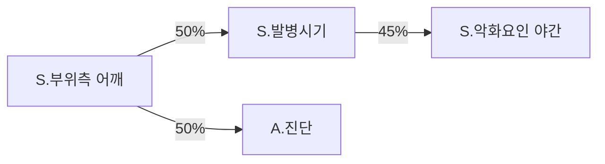

# CCF 반응형 클릭 차팅 — 마르코프 체인 기반 다음 항목 추천 설계

> 목적: 의사의 과거 차팅 시퀀스를 학습해, 클릭 차팅에서 **현재 항목 → 다음 항목**을 추천하기 위한 모델 설계 문서
> 입력 데이터: `visit_timeline.csv` (12,284건)
> 분해 포맷: `docs/CCF_SOAP_case_decomposition.md`
> 스키마: `docs/CCF_SOAP_charting_requirements.md`

---

## 1. 풀려는 문제

> 의사가 방금 **"호소부위 = 허리"**를 클릭했다. 다음에 누를 칩은 무엇인가?

이 질문에 대답하려면 "현재 클릭한 항목" → "다음에 클릭한 항목"의 분포를 알아야 한다. 이는 곧:

```
P(다음 항목 = Y | 현재 항목 = X)
```

를 추정하는 것이고, 이 단순한 형태의 시퀀스 모델이 곧 **(1차) 마르코프 체인**이다.

---

## 2. 마르코프 체인 — 한 줄 정의

> 현재 항목이 X일 때, 다음 항목이 Y일 확률을 모은 표.

핵심 가정 (1차 마르코프 가정):

> 다음 항목은 **바로 직전 항목 하나에만** 의존한다. (그 이전 흐름은 무시)

이 가정이 강해 보이지만, 차팅의 짧은 구간에서는 꽤 잘 맞는다. 약한 부분은 §6에서 다룬다.

---

## 3. 왜 차팅 문제에 자연스럽게 들어맞는가

차팅은 **항목들의 순차적 입력**이다.

```
호소부위 → 측 → 발병시기 → 양상 → 악화요인 → 영상 → 진단 → PT → 약물 → FU
```

우리가 만들려는 클릭 차팅 UI는 결국 "직전 클릭을 보고 다음 칩 후보를 정렬하는 일"이고, 이 표는 곧 마르코프 체인의 transition matrix다.

---

## 4. 우리 10건으로 만든 작은 예시 — 어깨 케이스 2건

`CCF_SOAP_case_decomposition.md`의 Case 2 (이정우)와 Case 6-B (권희)를 토큰 시퀀스로 바꾸면:

**Case 2 이정우:**
```
S.부위측(어깨) → S.발병시기 → S.악화요인(야간) → S.악화요인(동작)
              → S.사회력 → O.검진(LOM) → A.진단 → P.PT+약물 → P.FU
```

**Case 6-B 권희 (간소형):**
```
S.부위측(어깨) → A.진단(Frozen) → P.운동 → P.Escalation
```

**"S.부위측(어깨) 직후"** 무엇이 오는지 세어보면:

| 다음 항목 | 빈도 | 확률 |
|---|---|---|
| S.발병시기 | 1 | 50% |
| A.진단 (바로 점프) | 1 | 50% |

→ UI 룰로 번역: **"어깨 호소 클릭 시, 발병시기 칩과 진단 칩을 같은 비중으로 추천."**

이걸 모든 (현재 → 다음) 페어에 대해 채우면 transition matrix가 완성된다.

---

## 5. 부위별로 분리하는 이유

부위를 섞어서 통계를 내면 다음과 같이 **희석된 평균**이 나온다:

```
S.부위측 → S.발병시기  : 60%
S.부위측 → S.기전     : 20%
S.부위측 → A.진단     : 20%
```

그런데 실제로는 부위별로 흐름이 완전히 다르다:

| 부위 | 부위측 클릭 직후 의사가 묻는 것 |
|---|---|
| 어깨 | 야간통 / 동작별 통증 (외상이 드물어서) |
| 발목 | 외상 기전 (외상이 디폴트라서) |
| 허리 | 방사통 양상 / 외상력 |
| 무릎 | 외상 vs 만성 분기 |

→ 합쳐버리면 어느 부위에도 잘 맞지 않는 추천이 된다. **부위 = 별도 마르코프 체인**으로 분리한다.

---

## 6. 1차 마르코프의 한계

### 6-1. 직전 항목만 보는 것의 한계
Case 7 (한영숙)에서 "외상력 = 3년 전 낙상"이 나오면, 그 한 항목이 이후 흐름(R/O 진단, 정보 수집 모드, 외부 영상 요청)을 통째로 결정한다. **직전이 아니라 앞쪽 어딘가의 항목이 영향을 미친다.**

→ 보강:
- 2차/3차 마르코프 (n-gram): 직전 2~3개 항목을 함께 고려
- 상태 플래그 동반: "외상력=있음", "추적방문=true" 같은 잠재 상태를 함께 들고 다니기 (hidden-state 모델)
- 더 강하게는 작은 트랜스포머/RNN

### 6-2. 데이터 희소성
항목 종류가 많아질수록 (A→B) 페어가 한 번도 등장하지 않는 경우가 대부분이 된다. 어깨만 따로 봐도 12,284건 중 비율이 적을 수 있다.

→ 보강:
- **항목 토큰 단위를 거칠게**: "1주 전 / 2주 전"을 합쳐 "발병시기" 하나로 통합
- **smoothing** (Laplace 등)으로 0 확률 회피
- 부위 간 **공통 흐름 부분은 글로벌 모델**, 부위 특유 부분만 별도 모델 (계층적 구조)

### 6-3. 시간/맥락 정보 손실
"1주 전 발병"과 "오늘 발병"은 마르코프에서는 그냥 다른 토큰일 뿐, **그 차이가 다음 항목 분포에 어떻게 영향 주는지**까지 자동으로 학습되지는 않는다.

→ 보강: 토큰을 의미적으로 묶어서 처리 (예: "급성 외상" vs "만성")

---

## 7. 산출물 형태

부위별로 다음 세 가지가 나온다:

### 7-1. Transition matrix (CSV)
행 = 현재 항목, 열 = 다음 항목, 값 = 확률

```
현재항목,S.발병시기,S.양상,S.악화요인,O.검진,A.진단,...
S.부위측,0.50,0.10,0.05,0.00,0.30,...
S.발병시기,0.00,0.45,0.30,0.05,0.10,...
...
```

### 7-2. 그래프 다이어그램
노드 = 항목, 엣지 = 전이 (확률을 굵기/색으로). Mermaid 또는 graphviz로 시각화.



### 7-3. UI 룰 (JSON)
```json
{
  "shoulder": {
    "S.부위측": [
      {"next": "S.발병시기", "p": 0.50, "ui": "auto-focus"},
      {"next": "A.진단",    "p": 0.50, "ui": "side-chip"}
    ]
  }
}
```

---

## 8. UI 룰 변환 정책 (초안)

| 확률 구간 | UI 동작 |
|---|---|
| ≥ 70% | 다음 입력 필드로 **자동 포커스 / 자동 펼침** |
| 30 ~ 70% | **사이드 추천 칩** 상단에 노출 |
| 10 ~ 30% | "+ 더보기" 안에 노출 |
| < 10% | 노출하지 않음 (자유 입력으로만) |

확률 임계값은 의사 사용자 테스트로 보정.

---

## 9. 구현 파이프라인 (제안)

```
[12,284건 차팅 텍스트]
        ↓ (1) 부위 분류
[부위별 케이스 묶음]
        ↓ (2) 토큰화 (vocabulary 기반)
[토큰 시퀀스 N개]
        ↓ (3) 페어 카운트 + 정규화
[부위별 transition matrix]
        ↓ (4) UI 룰 변환
[추천 룰 JSON]
        ↓ (5) 클릭 차팅 UI 통합
[반응형 차팅]
```

각 단계의 산출물은 `docs/`에 누적 저장 (재현성 확보).

---

## 10. 사전에 합의해야 할 것 (선결과제)

본 모델의 품질은 **토큰 사전(vocabulary)을 어떻게 짜느냐**에 거의 전적으로 달려 있다. 너무 거칠면 분기가 뭉개지고, 너무 잘면 데이터가 흩어져서 확률이 의미 없어진다.

### 10-1. 토큰 단위 결정 항목

| 항목 | 옵션 A (거친) | 옵션 B (세밀) |
|---|---|---|
| 발병 시기 | `S.발병시기` 하나 | `S.발병시기.오늘`, `S.발병시기.1주`, `S.발병시기.만성` 분리 |
| 통증 양상 | `S.양상` 하나 | `S.양상.야간통`, `S.양상.방사통`, `S.양상.동작별` 분리 |
| 악화 요인 | `S.악화요인` 하나 | `S.악화요인.보행`, `S.악화요인.기침`, `S.악화요인.회전` 분리 |
| 영상 | `O.영상` 하나 | `O.영상.xray`, `O.영상.MRI`, `O.영상.초음파` 분리 |
| 진단 | `A.진단` 하나 | ICD 코드 단위 |

**1차 베이스라인은 옵션 A (거친 단위)** 추천. 분기가 충분히 보이면 점진적으로 세분화.

### 10-2. 부위 분류 규칙

`CCF_SOAP_charting_requirements.md` §1.1의 호소 부위 12종을 1차 분류로 사용:
> 어깨 / 무릎 / 허리 / 목 / 손목 / 발목 / 고관절 / 팔꿈치 / 등 / 손가락 / 발가락 / 골반

다부위 케이스 (Case 6 권희, Case 7 한영숙)는 **부위별로 분리해 각각의 체인에 기여**시킨다.

### 10-3. 내원 모드 분기
케이스 분해에서 발견된 4가지 모드:
- 호소 / 추적 / 처치 / 수술 후

→ 모드별로도 별도 체인을 만들 것인가? **1차 베이스라인은 호소 모드만** 추천 (양적으로 가장 많고 CCF 스키마도 호소 위주).

---

## 11. 한계 정리 (다시)

- 마르코프 체인은 **베이스라인 모델**이다. 충분히 강력하지만, 의사 사고의 비국소적 의존(외상력 한 번이 이후 모든 흐름을 바꾸는 등)은 잡지 못한다.
- 의사 식별 컬럼이 없어 **단일 의사 가정**으로 시작. 의사별 개인화는 ID 매핑이 추가된 뒤 별도 단계로.
- 차팅 텍스트의 순서는 **사후 보정될 수 있다** (의사가 적는 순서 ≠ 환자에게 묻는 순서). 이 한계는 텍스트 분석만으로는 제거 불가.

---

## 12. 다음 액션

1. **토큰 사전 합의** (옵션 A로 시작할지 확정)
2. **부위 분류 규칙 확정** (다부위 처리 포함)
3. **파일럿**: 가장 큰 부위 1~2개 (예: 허리, 어깨)에 대해 전체 12,284건을 대상으로 transition matrix 산출
4. **결과 리뷰**: 그래프 다이어그램으로 확률 흐름을 사용자(의사)와 함께 검토
5. **UI 룰 임계값 보정**: 70/30/10% 임계값을 사용자 테스트로 조정
6. **필요시 n-gram 또는 hidden-state로 확장**
