# CCF 마스터 테이블 생성 전략

> 작성일: 2026-06-10
> 목적: CCF SOAP 구조화에 필요한 마스터 테이블 설계 — 무엇을 만들고, 계층 구조인지, 차팅에서 뽑을지 외부표준이 필요한지
> 관련: [[CCF_extraction_PoC_result_2026-06-10]], [[CCF_extraction_first_strategy_2026-05-07]] §7.3, [[1_schema_definition]]

---

## 1. 생성할 테이블 목록 + 구조

| # | 테이블 | 구조 | 셀프계층? | 핵심 컬럼 |
|---|---|---|---|---|
| T1 | `mst_body_part` | **adjacency list** | ✅ **예** | `id, parent_id, name, node_type, name_en` |
| T2 | `laterality` | enum (lookup) | ❌ 아니오 | `좌 / 우 / 양측 / 중앙` |
| T3 | `mst_diagnosis` | flat | ❌ (코드접두로 분류만) | `kcd_code(PK), name, category, freq` |
| T4 | `mst_order` | flat + type 1단 | ❌ 얕은 2단 | `order_id, name, order_type, medfee_cd, freq` |
| T5 | `mst_exam_item` | flat + category | ❌ (body_part 참조) | `item_id, category, name, target_part, target_node, value_type` |
| T6 | `mst_value_scale` | enum (lookup) | ❌ 아니오 | `+/- , +/+ , 각도 , grade(v/v|0~5) , % , 거리(m)` |
| — | **tenderness** | *테이블 없음* | — | `mst_body_part` 노드 재사용 + result |
| — | **pain_quality 등** | *마스터 아님* | — | 임베딩 **클러스터** (§7.3) |
| G1 | `map_alias` | flat (다형 참조, 학습) | ❌ | `surface(PK), canonical_id, target_table, alias_type, source, confidence` |

> G1 `map_alias`는 기존 `map_abbreviation`(약어) + `map_synonym`(동의어)를 **통합**한 단일 사전. 상세 = §7.

### 구조 결정 요지 (개조식)
- **T1 부위만 셀프계층** — 부위마다 깊이가 다름(무릎=구조물 깊이 / 허리=레벨 깊이). `parent_id` 자기참조 + `node_type`(부위/영역/레벨/구조물)으로 가변 깊이 흡수.
- **laterality(T2)는 계층 아님** — 좌/우/중앙은 부위의 자식이 아니라 **직교 축** → 별도 enum, 추출결과에 컬럼으로 부착.
- **T5 검진은 계층 아님** — `category`(gross/special_test/motor/sensory/reflex)로 평탄 분류 + `target_node`로 T1을 **참조**(FK)만.
- **Tenderness는 새 테이블 X** — "구조물/레벨에 대한 압통 +/-" → T1 노드 재사용. 어휘 중복 제거.
- **통증양상·서술은 마스터 금지** — 표현 다양성 보존 위해 클러스터(§7.3.3).

---

## 2. 이미지(허리 검진표) 커버리지 검증

> 검증 질문: 제안 마스터로 **이미지의 모든 셀을 표현 가능한가?** → **결론: 100% 커버**

| 이미지 셀 | 매핑 마스터 | 노드/값 예시 |
|---|---|---|
| 부위: **허리** | T1 (node_type=부위) | `허리` |
| 세부부위(1): 오른쪽/왼쪽/중앙 | T2 laterality | `좌/우/중앙` |
| 세부부위(2) [Lumbar] L1~L5 | T1 (node_type=레벨, parent=허리) | `L1…L5` |
| [Sacrum] Buttock, SI joint | T1 (node_type=레벨) | `Buttock, SI joint` |
| [Coccyx] Coccyx | T1 (node_type=레벨) | `Coccyx` |
| Gross finding *(허리 생략됨)* | T5 category=gross | (허리는 비어있음 — 스키마상 정상) |
| **압통(Tenderness)** L1~L5/Buttock/SI/Coccyx | **T1 노드 재사용** + result | `tenderness(node=L4, +)` |
| 신체검진: SLR (각도/각도) | T5 special_test + T6 | `value_type=각도/각도` (예: 45/full) |
| Claudication : 200m | T5 special_test + T6 | `value_type=거리(m)` |
| [motor] Hip Flexion(L2)(v/v) … S1 | T5 category=motor, target_node=레벨 | `value_type=grade(v/v)` |
| [sensory] L1~S1 dermatome(100%/100%) | T5 category=sensory, target_node=레벨 | `value_type=%` |
| [DTR] Achilles, patellar tendon | T5 category=reflex | `value_type=+/++/+++` |
| Barbinski's sign | T5 category=reflex(병적반사) | `value_type=+/-` |

### 검증 결과 (개조식)
- ✅ **부위·레벨 계층** → T1 셀프계층이 Lumbar/Sacrum/Coccyx 3그룹 + L1~S1을 그대로 표현.
- ✅ **압통 = 레벨 재사용** → 별도 마스터 없이 T1 노드에 +/- 부착. (이미지에서 세부부위2와 압통 칸이 같은 목록인 게 증거)
- ✅ **검진 4종(SLR/motor/sensory/reflex)** → T5 한 테이블에 category로 흡수, 값 척도는 T6가 분리 관리.
- ✅ **motor의 (L2)(L3)… 표적** → "검사 ↔ 신경레벨" 연결을 `target_node`(T1 FK)로 해결.
- ⚠️ 유일한 주의: **value 표기 다양성**(`(v/v)`, `(45/full)`, `(100%/100%)`) → T6 value_type으로 정의하되, 실제 표기 파싱은 추출 규칙 필요.

---

## 3. 차팅 추출 가능 vs 외부 마스터 필요

> 원칙: **차팅 = 실제 기록된 "값"(관측치, sparse) / 마스터 = 완전한 "어휘·구조·코드"(catalog)**

### 3.1 현재 차팅 테이블에서 뽑을 수 있는 것
| 항목 | 출처 | 비고 (PoC 채움률) |
|---|---|---|
| 진단 코드·명 (T3) | `진단목록` 칼럼 | ✅ 자동, KCD 317개 + 정답지 |
| 처방·시술·약 (T4) | `처방목록` + `convert_ptnt_ord` | ✅ 자동, 오더 498개 + medfee_cd |
| 부위(T1 상위) / 좌우(T2) | `증상·차팅` LLM 추출 | 90% / 66% |
| 레벨(L4-5 등) | 차팅 LLM 추출 | sparse (SNRB/MBB 맥락) |
| 검진 **값** (SLR 45, ADF v/v, DTR intact) | 차팅 LLM 추출 | ⚠️ 낮음 (O.physical_exam 10%, neuro 4%) |
| 약어 후보(D1) | 차팅 본문 수집 | ✅ HNP/SNRB/MBB/MPS… 자동 |

### 3.2 외부 마스터(데이터 밖)가 필요한 것
| 항목 | 필요 출처 | 이유 |
|---|---|---|
| **부위 계층 전체(T1)** | **CCF PDF** | 차팅엔 등장한 부위만 있음 → 완전한 트리는 PDF |
| **구조물 목록(Meniscus/MCL…)** | **CCF PDF** | 차팅에 거의 안 적힘 |
| **검진 카탈로그(T5 전체)** | **CCF PDF** | 차팅은 "쓴 것만" 있음 → 검사 *전체 목록*과 부위·표적 연결은 PDF |
| **value 척도 정의(T6)** | CCF PDF p.12~13 | grade/dermatome/DTR 표기 표준 |
| KCD 명칭·계층 보정 | KCD-8 마스터 | 절삭·이형 보정 |
| 약품 분류(NSAIDs 등) | KIMS / 심평원 | 약 class·코드 |

### 3.3 핵심 정리 (개조식)
- **차팅이 주는 것** = "이 환자에게 *실제로 무엇이 관측됐나*" (값, 빈도, 의사 약어) — 단, **sparse**.
- **외부 마스터가 주는 것** = "*무엇이 관측 가능한가*"의 완전한 어휘·구조·표준코드 — **catalog**.
- 따라서 **T3·T4·약어 = 차팅에서 자동 부트스트랩**, **T1·T5·T6 = CCF PDF에서 구축**, **코드 보정 = 외부표준(KCD/KIMS/심평원)**.
- 검진 항목(T5)은 *마스터는 PDF, 값은 차팅* — **둘이 합쳐져야** O섹션이 완성됨. (마스터=뼈대, 차팅=살)

---

## 4. 범용 vs 병원·의사 고유 (요약)

| 레이어 | 범용 (이식 가능) | 고유 (자동 학습) |
|---|---|---|
| T1 부위·구조물 / T5 검진 카탈로그 / T6 척도 | 🟢 의학·해부 표준 | — |
| T3 KCD / T4 약·시술 코드 | 🟢 국가표준 | 분포·빈도 |
| 약어(G1) / 동의어(G2) | 🟢 표준 의학약어 | 🔴 의사 개인 축약·표현 |
| 클러스터(통증양상) | — | 🔴 의사·환자별 |

→ **범용 뼈대(고정) + 병원별 학습 레이어(자동)** 2층 구조 → 신규 병원 온보딩 비용 ≈ 0.

---

## 5. ERD (마스터 + 연관 + 방문결과)

> 노드(마스터 T1~T6) · 엣지(연관 rel_*) · 인스턴스(방문 visit_ccf_*) 3층 구조.
> `rel_*` = 임상 지식 그래프(M:N). 진단↔검사=PDF(범용), 진단↔처방=데이터 채굴(병원고유).

```mermaid
erDiagram
    mst_body_part {
        int id PK
        int parent_id FK "self → 1:N 계층"
        string name
        enum node_type "부위|영역|레벨|구조물"
        string name_en
    }
    laterality {
        char code PK
        string label "좌|우|양측|중앙"
    }
    mst_diagnosis {
        string kcd_code PK
        string name
        string category
        int freq
    }
    mst_order {
        int order_id PK
        string name
        enum order_type
        string medfee_cd
        int freq
    }
    mst_exam_item {
        int item_id PK
        enum category "gross|special_test|motor|sensory|reflex"
        string name
        int target_part FK
        int target_node FK
        string value_type FK
    }
    mst_value_scale {
        string value_type PK
        string pattern
        string example
    }
    map_alias {
        string surface PK
        string canonical_id
        enum target_table
        enum alias_type "동의어|약어|약식|절삭|brand"
        enum source "std|learned"
        float confidence
    }

    rel_part_diagnosis {
        int body_part_id FK
        string kcd_code FK
        float support
    }
    rel_diagnosis_exam {
        string kcd_code FK
        int item_id FK
        string source "PDF(범용)"
    }
    rel_diagnosis_order {
        string kcd_code FK
        int order_id FK
        float support "데이터채굴(고유)"
    }
    rel_structure_exam {
        int node_id FK
        int item_id FK
    }

    visit_ccf_S {
        string recept_no PK
        int body_part_id FK
        char laterality FK
        string onset
        string mechanism
        string pain_quality
    }
    visit_ccf_O {
        string recept_no FK
        enum category
        int ref_id FK
        string result
    }
    visit_ccf_A {
        string recept_no FK
        string kcd_code FK
        string dx_text
        enum status
    }
    visit_ccf_P {
        string recept_no FK
        enum order_type
        int order_ref FK
        string detail
    }

    %% --- 구조적 FK (마스터 내부) ---
    mst_body_part   ||--o{ mst_body_part   : "parent (1:N 셀프계층)"
    mst_body_part   ||--o{ mst_exam_item   : "target_part"
    mst_body_part   ||--o{ mst_exam_item   : "target_node"
    mst_value_scale ||--o{ mst_exam_item   : "value_type"

    %% --- 임상 연관 (M:N junction = 지식 그래프 엣지) ---
    mst_body_part   ||--o{ rel_part_diagnosis : ""
    mst_diagnosis   ||--o{ rel_part_diagnosis : ""
    mst_diagnosis   ||--o{ rel_diagnosis_exam : ""
    mst_exam_item   ||--o{ rel_diagnosis_exam : ""
    mst_diagnosis   ||--o{ rel_diagnosis_order: ""
    mst_order       ||--o{ rel_diagnosis_order: ""
    mst_body_part   ||--o{ rel_structure_exam : ""
    mst_exam_item   ||--o{ rel_structure_exam : ""

    %% --- 별칭/약어 매핑 (다형 참조: target_table로 분기) ---
    map_alias }o--|| mst_diagnosis : "target_table=mst_diagnosis"
    map_alias }o--|| mst_order     : "target_table=mst_order"
    map_alias }o--|| mst_exam_item : "target_table=mst_exam_item"

    %% --- 방문결과 → 마스터 참조 (인스턴스) ---
    mst_body_part   ||--o{ visit_ccf_S : "body_part_id"
    laterality      ||--o{ visit_ccf_S : "laterality"
    mst_exam_item   ||--o{ visit_ccf_O : "ref_id"
    mst_diagnosis   ||--o{ visit_ccf_A : "kcd_code"
    mst_order       ||--o{ visit_ccf_P : "order_ref"
```

> 읽는 법: **마스터(mst_)는 어휘·구조 고정** → **rel_은 그 사이 임상 지식(엣지)** → **visit_ccf_는 방문별 실제 값(FK+값)**. 다운스트림(누락알림·청구검증·유사사례)은 전부 `rel_*` 엣지 위에서 작동.

---

## 6. 테이블 상세 정의 + 예시 row

> 값 출처: 진단/처방/약어 = `visit_timeline.csv` 실측, 부위/검진 = CCF PDF·이미지 검증 구조

### T1. `mst_body_part` — 부위 계층 (셀프계층)
| 컬럼 | 타입 | 설명 |
|---|---|---|
| `id` (PK) | int | 노드 고유 |
| `parent_id` | int FK→self | 상위 노드 (루트=NULL) |
| `name` | varchar | 노드명 |
| `node_type` | enum | 부위 / 영역 / 레벨 / 구조물 |
| `name_en` | varchar | 영문 |

| id | parent_id | name | node_type | name_en |
|---|---|---|---|---|
| 1 | NULL | 허리 | 부위 | Lumbar |
| 2 | 1 | L4 | 레벨 | L4 |
| 3 | 1 | L5 | 레벨 | L5 |
| 4 | 1 | SI joint | 레벨 | SI joint |
| 5 | 1 | Coccyx | 레벨 | Coccyx |
| 20 | NULL | 무릎 | 부위 | Knee |
| 21 | 20 | 내측 | 영역 | medial |
| 22 | 21 | Meniscus | 구조물 | Meniscus |
| 23 | 21 | MCL | 구조물 | MCL |

### T2. `laterality` — 측 enum (lookup)
| 컬럼 | 타입 | 설명 |
|---|---|---|
| `code` (PK) | char | 코드 |
| `label` | varchar | 표시 |

| code | label |
|---|---|
| L | 좌 |
| R | 우 |
| B | 양측 |
| C | 중앙 |

### T3. `mst_diagnosis` — 진단 (flat, KCD-8) · *차팅 자동*
| 컬럼 | 타입 | 설명 |
|---|---|---|
| `kcd_code` (PK) | varchar | KCD-8 코드 |
| `name` | varchar | 진단명 |
| `category` | varchar | 코드접두 분류 |
| `freq` | int | 데이터 등장 빈도 |

| kcd_code | name | category | freq |
|---|---|---|---|
| K219 | 식도역류 NOS | 소화기 | 3187 |
| M5456 | 요통, 요추부 | 근골격 | 2352 |
| S3350 | 요추의 염좌 및 긴장 | 손상 | 1354 |
| M2557 | 관절통, 발목 및 발 | 근골격 | 755 |
| S134 | 경부의 전종(인대)의 염좌 및 긴장 | 손상 | 638 |

### T4. `mst_order` — 처방·시술·약 (flat) · *차팅 자동*
| 컬럼 | 타입 | 설명 |
|---|---|---|
| `order_id` (PK) | int | 고유 |
| `name` | varchar | 오더명 |
| `order_type` | enum | 약/주사/물리·시술/영상/진찰료 |
| `medfee_cd` | varchar | 심평원 수가코드 (원본 보강) |
| `freq` | int | 빈도 |

| order_id | name | order_type | medfee_cd | freq |
|---|---|---|---|---|
| 1 | 심층열치료[1일당] | 물리·시술 | (보강필요) | 6870 |
| 2 | 재활저출력레이저치료 | 물리·시술 | — | 6724 |
| 3 | 펠루비서방정 | 약 | — | 2549 |
| 4 | 케이캡정25밀리그램 | 약 | — | 2147 |
| 5 | 체외충격파 | 시술 | — | — |

### T5. `mst_exam_item` — 검진 카탈로그 (flat + category) · *CCF PDF*
| 컬럼 | 타입 | 설명 |
|---|---|---|
| `item_id` (PK) | int | 고유 |
| `category` | enum | gross/special_test/motor/sensory/reflex |
| `name` | varchar | 검사명 |
| `target_part` | int FK→T1 | 적용 부위 |
| `target_node` | int FK→T1 | 표적 구조물/레벨 (없으면 NULL) |
| `value_type` | FK→T6 | 값 척도 |

| item_id | category | name | target_part | target_node | value_type |
|---|---|---|---|---|---|
| 1 | special_test | SLR test | 허리 | (신경근) | 각도/각도 |
| 2 | special_test | Claudication | 허리 | NULL | 거리(m) |
| 3 | motor | Hip Flexion | 허리 | L2 | grade(v/v) |
| 4 | motor | Ankle dorsi flexion | 허리 | L4 | grade(v/v) |
| 5 | sensory | dermatome | 허리 | L5 | %/% |
| 6 | reflex | Achilles tendon DTR | 허리 | S1 | +/++/+++ |
| 7 | reflex | Barbinski's sign | 허리 | NULL | +/- |
| 8 | special_test | Mcmurray test | 무릎 | Meniscus | +/+ |

### T6. `mst_value_scale` — 값 척도 (lookup)
| 컬럼 | 타입 | 설명 |
|---|---|---|
| `value_type` (PK) | varchar | 척도 ID |
| `pattern` | varchar | 표기 형식 |
| `example` | varchar | 예시 |

| value_type | pattern | example |
|---|---|---|
| +/- | 단일 양/음 | (+) |
| +/+ | 좌/우 쌍 | (+/-) |
| 각도/각도 | 측정/정상 | 45/full |
| grade(v/v) | 좌/우 등급 | (v/v), (iv/v) |
| %/% | 좌/우 비율 | (100%/30%) |
| +/++/+++ | DTR 등급 | (++/++) |
| 거리(m) | 보행거리 | 200m |

### G1. `map_alias` — 표기 변이 통합 사전 (다형 참조, 학습) · *차팅 자동 + 큐레이션*
> 약어·동의어·약식·절삭·brand를 한 테이블로. 컬럼/전략 상세 = §7.

| surface | canonical_id | target_table | alias_type | source | freq |
|---|---|---|---|---|---|
| HNP | M51x | mst_diagnosis | 약어 | std | 246 |
| MPS | 근막동통증후군 | mst_diagnosis | 약어 | std | 271 |
| 오십견 | M750 | mst_diagnosis | 동의어 | std | — |
| 동결견 | M750 | mst_diagnosis | 동의어 | std | — |
| SNRB | (선택적신경근차단술) | mst_order | 약어 | std | 404 |
| Lt | L | laterality | 약어 | std | 706 |
| Mc | (Mcmurray) | mst_exam_item | 약식 | std | — |
| 펠루비서방정(펠루비 | (medfee_cd) | mst_order | 절삭 | learned | 2549 |

---

### 방문별 추출결과 저장 (마스터 참조, 플랫) — 예: `recept_no=2401166`
> 차팅 "좌측 다리 당김 저림 … HNP r/o … PO 1wk SNRB L4-5-S1 Lt … MRI 후 재진" 추출 결과

**`visit_ccf_S`** (호소)
| recept_no | body_part_id | laterality | onset | mechanism | pain_quality |
|---|---|---|---|---|---|
| 2401166 | 1 (허리/다리) | L | 오늘아침 | — | 당김,저림 |

**`visit_ccf_O`** (검진 — item_id 또는 structure_id 참조)
| recept_no | category | ref_id | result |
|---|---|---|---|
| 2401166 | neuro | (발목 마비) | + |

**`visit_ccf_A`** (진단)
| recept_no | kcd_code | dx_text | status |
|---|---|---|---|
| 2401166 | M51x | HNP | r/o |

**`visit_ccf_P`** (계획 — order 참조)
| recept_no | order_type | order_ref | detail |
|---|---|---|---|
| 2401166 | 약 | (PO) | 1wk |
| 2401166 | 주사 | SNRB | L4-5-S1 Lt |
| 2401166 | 영상계획 | MRI | 촬영 후 재진 |

> 포인트: **마스터(T1~T6)는 어휘·구조를 고정**, **visit_ccf_* 는 그 FK + 실제 값**만 저장 → 검색·집계·정답대조 모두 코드 단위로 가능.

---

## 7. 표기 변이(notation variance)와 alias 전략

> 같은 개념이 차팅·원본에서 여러 표기로 등장 → 마스터로 접으려면 정규화가 필요.
> 아래 빈도는 `visit_timeline.csv` 실측.

### 7.1 실측된 표기 변이 (증거)
| 마스터 | 같은 개념, 다른 표기 (빈도) |
|---|---|
| laterality | `좌측`(3668) · `왼쪽`(18) · `Lt`(706) → '좌' / `우측`(3742) · `Rt`(728) → '우' |
| 처방(물리) | `물리치료`(4194) · `P-T`(2111) · `도수치료`(1874) · `도수`(115) · `충격파`(2379) · `체외충격파`(1020) |
| 검사 | `Mcmurray`(7) · `Mc`(4) · `Mc(`(2) → 동일 검사 |
| 처방 절삭 | **498개 중 131개(26%) 잘림** — `펠루비서방정(펠루비`, `표층열치료(심층열동` |

### 7.2 변이의 3가지 출처 → 해결책 분기
| 출처 | 예 | 해결 |
|---|---|---|
| (a) 원본 EMR 절삭 | `펠루비서방정(펠루비` | 🔧 **규칙** — `medfee_cd` 코드 조인 (코드가 정답) |
| (b) 의사 자유텍스트 | 좌측/Lt, 물리치료/P-T, 오십견/동결견 | 📖 **사전(`map_alias`)** |
| (c) 외부표준 차이 | 케이캡정(brand)/테고프라잔(generic) | 📖 사전 + KIMS 매핑 |

### 7.3 규칙 vs 사전 테이블 분리
- 🔧 **규칙으로 해결 (유한·결정적, 테이블 불필요)**
  - laterality: `{좌측,왼쪽,Lt,(L)} → L` (닫힌 집합, 정규식)
  - value 표기: `(v/v),(iv/v),(5/5)` → grade 파싱
  - 처방 절삭: `medfee_cd` 조인 복원
- 📖 **사전 테이블 필요 (열린 집합·학습 대상) = `map_alias`**
  - 진단 동의어: 오십견=동결견=유착성관절낭염=adhesive capsulitis → M750
  - 의사 약어: HNP, SNRB, MBB, MPS, TFCC…
  - 검사 약식: Mc → Mcmurray
  - 약품 brand↔generic

### 7.4 `map_alias` 테이블 (G1 — 다형 참조 통합 사전)
| 컬럼 | 타입 | 설명 |
|---|---|---|
| `surface` (PK) | varchar | 표면 표기 |
| `canonical_id` | varchar | 표준 코드/노드 |
| `target_table` | enum | mst_diagnosis / laterality / mst_exam_item / mst_order |
| `alias_type` | enum | 동의어 / 약어 / 약식 / 절삭 / brand |
| `source` | enum | std(범용) / learned(데이터) |
| `confidence` | float | 0.0~1.0 |

**예시 row (실측 기반):**
| surface | canonical_id | target_table | alias_type | source |
|---|---|---|---|---|
| 오십견 | M750 | mst_diagnosis | 동의어 | std |
| 동결견 | M750 | mst_diagnosis | 동의어 | std |
| Lt | L | laterality | 약어 | std |
| P-T | (물리치료 order_id) | mst_order | 약어 | std |
| Mc | (Mcmurray item_id) | mst_exam_item | 약식 | std |
| 펠루비서방정(펠루비 | (medfee_cd) | mst_order | 절삭 | learned |

### 7.5 핵심 통찰
- **alias에도 범용/고유가 갈림**: `Lt→L`, `오십견→M750`, `HNP→추간판탈출` = 🟢 범용(표준 의학) / 이 의사 특유 줄임말·오타 = 🔴 고유(데이터 학습).
- **alias는 추출의 입력이자 출력 (피드백 루프)** ⭐: PoC에서 LLM이 이미 `좌측 다리`→`laterality=L`로 정규화함 → 추출 부산물로 (표면형→표준) 매핑이 나옴 → `map_alias`에 로깅하면 사전이 자동 성장. 반대로 그 사전을 프롬프트에 RAG 주입(의사별 약어집)하면 정확도↑ ([[CCF_extraction_first_strategy_2026-05-07]] §7.1 한국어 약어 대응과 일치).

---

## 8. 구축 우선순위

1. **T3 진단 / T4 처방** — 차팅에서 즉시 자동 생성 (+ 무료 정답지)
2. **T1 부위 계층 / T5 검진 / T6 척도** — CCF PDF에서 구축 (이미지 검증 완료)
3. **G1 약어** — 차팅 본문 자동 수집 + 큐레이션
4. **G2 동의어** — 추출 dx ↔ 진단목록 KCD 대조로 반자동
5. **클러스터(C)** — 임베딩 인프라 별도 PoC
