# 초기 ERD — 정형외과 CCF 마스터 스키마

> 작성일: 2026-06-11  
> 출처: `CCF_master_table_strategy_2026-06-10.md` + `master_data/orthopedic_master_data.xlsx`  
> 구조: **마스터(mst_)** → **임상참조** → **연관/접합(rel_)** → **방문 트랜잭션(visit_)**

---

## 전체 ERD

```mermaid
erDiagram

    %% ══════════════════════════════════════════
    %% LAYER 1 — 마스터 핵심 (Core Master T1~T6)
    %% ══════════════════════════════════════════

    mst_body_part {
        int     id          PK
        int     parent_id   FK  "self→셀프계층"
        string  name_ko
        string  name_en
        enum    node_type       "부위|영역|레벨|구조물"
        string  region
        bool    midline
    }

    laterality {
        char    code        PK
        string  label_ko        "좌|우|양측|중앙"
        string  label_en
    }

    mst_diagnosis {
        string  kcd_code    PK  "KCD-8 코드"
        string  name_ko
        string  name_en
        string  icd11
        string  region
        string  icd11_src       "web|kb"
    }

    mst_order {
        int     order_id    PK
        string  name
        enum    order_type      "약|주사|관절강내주사|물리치료|시술|영상|진찰료"
        string  medfee_cd
        int     freq
    }

    mst_exam_item {
        int     item_id     PK
        enum    category        "gross|special_test|motor|sensory|reflex"
        string  name
        string  name_full
        int     target_part     FK  "→mst_body_part"
        int     target_structure FK "→mst_body_part"
        string  value_type   FK  "→mst_value_scale"
        string  tests_for
    }

    mst_value_scale {
        string  value_type  PK
        string  pattern
        string  example
        string  description
    }

    %% ══════════════════════════════════════════
    %% LAYER 2 — 임상 참조 (Clinical Reference)
    %% ══════════════════════════════════════════

    neuro_level {
        string  nerve_root  PK
        string  myotome
        string  dermatome
        string  reflex
        string  region          "경추|요추"
    }

    mmt_grade {
        string  grade       PK  "MMT 0~5"
        string  label
        string  description
    }

    rom_reference {
        int     id          PK
        string  joint
        string  motion
        string  normal_ROM
    }

    red_flag {
        int     id          PK
        string  category
        string  sign
        string  action
    }

    imaging_findings {
        int     id          PK
        string  modality        "X-ray|MRI|초음파"
        string  finding
        string  term_en
    }

    grading_scale {
        string  scale       PK  "KL/Pfirrmann 등"
        string  applied
        string  grades
        string  src
    }

    outcome_scale {
        string  scale       PK  "ODI/VAS/NDI 등"
        string  applied_region
        string  range
    }

    medication {
        string  ingredient  PK
        string  class
        string  brand
    }

    subjective_vocab {
        int     id          PK
        string  axis            "onset|mechanism|pain_quality"
        string  term_ko
        string  term_en
    }

    peripheral_nerve {
        string  nerve       PK
        string  site
        string  symptom
        string  exam
        string  related_dx
    }

    mst_icd_crosswalk {
        string  kcd_code    FK  "→mst_diagnosis"
        string  icd11
        string  icd11_src
    }

    %% ══════════════════════════════════════════
    %% LAYER 3 — 연관/접합 (Junction & Rel)
    %% ══════════════════════════════════════════

    part_laterality {
        int     body_part_id  FK
        char    laterality    FK
        string  note
    }

    rel_part_diagnosis {
        int     body_part_id  FK
        string  kcd_code      FK
        float   support
    }

    rel_diagnosis_exam {
        string  kcd_code      FK
        int     item_id       FK
        string  positive_finding
    }

    rel_diagnosis_order {
        string  kcd_code      FK
        int     order_id      FK
        float   support
    }

    rel_structure_exam {
        int     node_id       FK
        int     item_id       FK
    }

    map_alias {
        string  surface       PK  "표면 표기"
        string  canonical_id
        enum    target_table      "mst_diagnosis|mst_order|mst_exam_item|laterality"
        enum    alias_type        "동의어|약어|약식|절삭|brand"
        enum    source            "std|learned"
        float   confidence
    }

    charting_abbrev {
        string  abbrev        PK
        string  category
        string  full_term
        string  korean
    }

    %% ══════════════════════════════════════════
    %% LAYER 4 — 방문 트랜잭션 (Visit Transaction)
    %% ══════════════════════════════════════════

    patient {
        string  patient_no  PK
        string  name
        date    birth_date
    }

    visit {
        int     visit_id    PK
        string  patient_no  FK
        date    visit_date
        string  doctor_id
    }

    visit_diagnosis {
        int     visit_id    FK
        string  kcd_code    FK
        string  dx_text
        enum    status          "r/o|imp|confirmed"
    }

    visit_prescription {
        int     id          PK
        int     visit_id    FK
        int     order_id    FK
        string  detail
    }

    visit_ccf_s {
        int     visit_id    FK  "1:1"
        int     body_part_id FK
        char    laterality  FK
        string  onset
        string  mechanism
        string  pain_quality
    }

    visit_ccf_o {
        int     id          PK
        int     visit_id    FK
        enum    category
        int     ref_id      FK  "→mst_exam_item"
        string  result
    }

    visit_ccf_a {
        int     id          PK
        int     visit_id    FK
        string  kcd_code    FK
        string  dx_text
        enum    status
    }

    visit_ccf_p {
        int     id          PK
        int     visit_id    FK
        enum    order_type
        int     order_ref   FK  "→mst_order"
        string  detail
    }

    %% ══════════════════════════════════════════════
    %% RELATIONSHIPS
    %% ══════════════════════════════════════════════

    %% --- L1: 마스터 내부 구조 ---
    mst_body_part      ||--o{ mst_body_part      : "parent_id (셀프계층)"
    mst_body_part      ||--o{ mst_exam_item      : "target_part / target_structure"
    mst_value_scale    ||--o{ mst_exam_item      : "value_type"

    %% --- L2: 임상 참조 연결 ---
    mst_diagnosis      ||--o{ mst_icd_crosswalk  : "kcd_code"

    %% --- L3: 연관/접합 ---
    mst_body_part      ||--o{ part_laterality    : "body_part_id"
    laterality         ||--o{ part_laterality    : "laterality"

    mst_body_part      ||--o{ rel_part_diagnosis : "body_part_id"
    mst_diagnosis      ||--o{ rel_part_diagnosis : "kcd_code"

    mst_diagnosis      ||--o{ rel_diagnosis_exam : "kcd_code"
    mst_exam_item      ||--o{ rel_diagnosis_exam : "item_id"

    mst_diagnosis      ||--o{ rel_diagnosis_order : "kcd_code"
    mst_order          ||--o{ rel_diagnosis_order : "order_id"

    mst_body_part      ||--o{ rel_structure_exam : "node_id"
    mst_exam_item      ||--o{ rel_structure_exam : "item_id"

    map_alias          }o--o{ mst_diagnosis      : "target=mst_diagnosis"
    map_alias          }o--o{ mst_order          : "target=mst_order"
    map_alias          }o--o{ mst_exam_item      : "target=mst_exam_item"
    map_alias          }o--o{ laterality         : "target=laterality"

    %% --- L4: 방문 트랜잭션 ---
    patient            ||--o{ visit              : "patient_no"

    visit              ||--o{ visit_diagnosis    : "visit_id"
    mst_diagnosis      ||--o{ visit_diagnosis    : "kcd_code"

    visit              ||--o{ visit_prescription : "visit_id"
    mst_order          ||--o{ visit_prescription : "order_id"

    visit              ||--|| visit_ccf_s        : "visit_id (1:1)"
    visit              ||--o{ visit_ccf_o        : "visit_id"
    visit              ||--o{ visit_ccf_a        : "visit_id"
    visit              ||--o{ visit_ccf_p        : "visit_id"

    mst_body_part      ||--o{ visit_ccf_s        : "body_part_id"
    laterality         ||--o{ visit_ccf_s        : "laterality"
    mst_exam_item      ||--o{ visit_ccf_o        : "ref_id"
    mst_diagnosis      ||--o{ visit_ccf_a        : "kcd_code"
    mst_order          ||--o{ visit_ccf_p        : "order_ref"
```

---

## 레이어별 역할 요약

| 레이어 | 테이블 | 역할 |
|---|---|---|
| **L1 마스터 핵심** | `mst_body_part`, `laterality`, `mst_diagnosis`, `mst_order`, `mst_exam_item`, `mst_value_scale` | 어휘·구조 고정 (범용 뼈대) |
| **L2 임상 참조** | `neuro_level`, `mmt_grade`, `rom_reference`, `red_flag`, `imaging_findings`, `grading_scale`, `outcome_scale`, `medication`, `subjective_vocab`, `peripheral_nerve`, `mst_icd_crosswalk` | 표준 임상지식 (lookup, 독립 참조) |
| **L3 연관/접합** | `part_laterality`, `rel_part_diagnosis`, `rel_diagnosis_exam`, `rel_diagnosis_order`, `rel_structure_exam`, `map_alias`, `charting_abbrev` | 임상 지식 그래프 엣지 + 표기 변이 정규화 |
| **L4 트랜잭션** | `patient`, `visit`, `visit_diagnosis`, `visit_prescription`, `visit_ccf_s/o/a/p` | 방문별 실제 관측값 (FK + 값) |

## 데이터 출처

| 테이블 | 구축 방법 |
|---|---|
| `mst_diagnosis`, `mst_order` | 차팅 데이터에서 **자동 부트스트랩** |
| `mst_body_part`, `mst_exam_item`, `mst_value_scale` | **CCF PDF**에서 구축 |
| `neuro_level`, `grading_scale` 등 임상참조 | **xlsx 시드** (도메인지식 + 웹검증) |
| `map_alias`, `charting_abbrev` | 차팅 본문 **자동 수집** + 큐레이션 |
| `visit_ccf_*` | **LLM 추출** (차팅 원문 → 구조화) |

## 주요 설계 결정

- **`mst_body_part` 셀프계층** — `parent_id + node_type`으로 가변 깊이 흡수 (허리=레벨계층, 무릎=구조물계층)
- **`laterality` 직교 축** — 부위의 자식이 아니라 별도 enum; `part_laterality`로 부위별 허용 측성 무결성 제어
- **`tenderness` 별도 테이블 없음** — `mst_body_part` 노드 + result 재사용
- **`map_alias` 다형 참조** — `target_table` 컬럼으로 진단·오더·검진·측성 별칭을 단일 사전에 통합
- **`rel_*` 엣지** — 누락 알림·청구 검증·유사 사례 추천은 전부 이 엣지 위에서 작동
