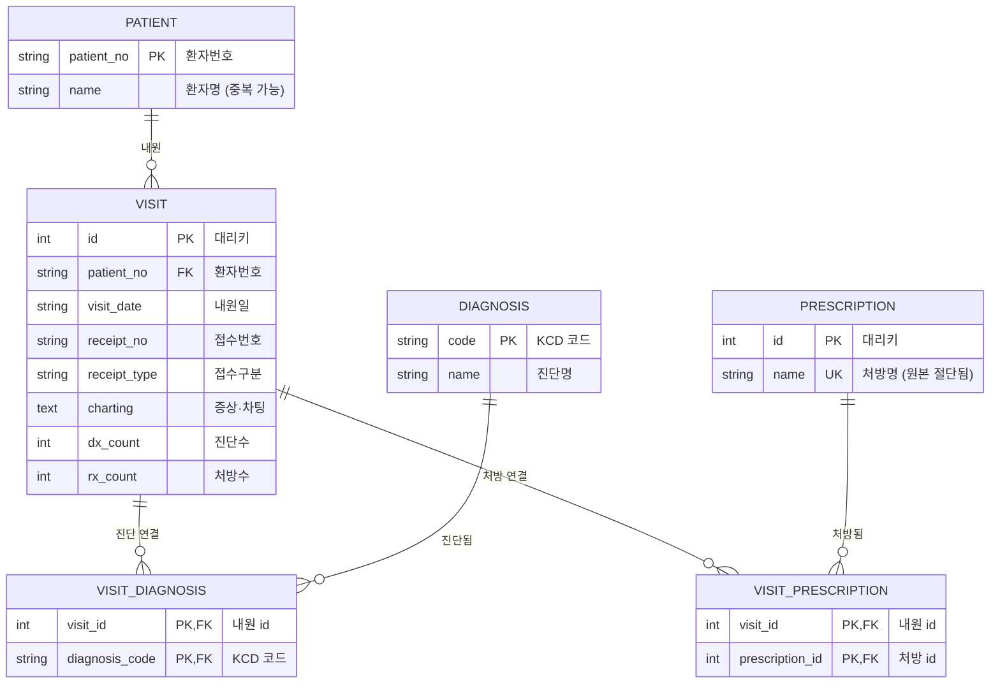

# Pedicle Interactive Chart — 데이터베이스 스키마 정의서

> 대상 DB: PostgreSQL 18 (`pedicle`)
> 원본 데이터: `visit_timeline.csv` (12,284행)
> 모델 정의: `app/models.py` · 적재 ETL: `app/seed.py` · 복원 뷰: `app/sql/v_visit_timeline.sql`

---

## 1. 개요

`visit_timeline.csv`(EMR 내원 타임라인)를 정규화하여 적재한 스키마다.
원본의 진단목록·처방목록은 한 셀에 여러 항목이 묶여 있어, 이를 **정규표현식으로 분해·유니크화**하여 차원 테이블로 분리하고,
내원 1건을 중앙 **팩트 테이블(`visit`)**로 두어 **브릿지 테이블**로 다대다(M:N) 관계를 연결한다.

분류상 순수 스타 스키마가 아니라 **브릿지 테이블을 가진 정규화 관계형 모델**이다.
진단·처방이 내원당 여러 개(M:N)이고 팩트의 핵심이 숫자 측정값이 아니라 텍스트(`charting`)이기 때문에,
이 데이터에는 순수 스타 스키마보다 이 구조가 적합하다.

### 구성 요약

| 구분 | 테이블 | 행수 | 역할 |
|------|--------|------|------|
| 차원 | `patient` | 4,561 | 환자 (환자번호 PK, 환자명) |
| 차원 | `diagnosis` | 379 | 진단 (KCD 코드 PK, 진단명) |
| 차원 | `prescription` | 490 | 처방 (id PK, 처방명 UNIQUE) |
| 팩트 | `visit` | 12,284 | 내원 1건 = 증상·차팅 중앙 테이블 |
| 브릿지 | `visit_diagnosis` | 19,557 | visit ↔ diagnosis (M:N) |
| 브릿지 | `visit_prescription` | 75,459 | visit ↔ prescription (M:N) |
| 뷰 | `v_visit_timeline` | 12,284 | 조인·집계로 원본 CSV 형태 복원 |

---

## 2. ERD (Mermaid)

---

## 3. 테이블 상세

### 3.1 `patient` (차원 — 환자)

| 컬럼 | 타입 | 제약 | 설명 |
|------|------|------|------|
| `patient_no` | `VARCHAR(32)` | **PK** | 환자번호. 원본 `환자번호` |
| `name` | `VARCHAR(64)` | NOT NULL | 환자명. 동명이인 존재(고유명 3,949 < 환자수 4,561)이므로 키로 부적합 |

- 자연키 `patient_no`를 PK로 사용한다.

### 3.2 `diagnosis` (차원 — 진단)

| 컬럼 | 타입 | 제약 | 설명 |
|------|------|------|------|
| `code` | `VARCHAR(32)` | **PK** | KCD 진단 코드 (예: `M750`, `S3350`, `M2496_KNEE`) |
| `name` | `VARCHAR(255)` | NOT NULL | 진단명. 같은 코드에 표기 변형이 있으면 최초 관측값 사용 |

- 원본 `진단목록` 셀을 ` / ` 로 분해 후 `^([A-Z][A-Z0-9_]*)\s+(.*)$` 정규식으로 `(코드, 진단명)` 추출.
- 따옴표로 감싼 진단명(내부 콤마 포함)은 따옴표 제거.

### 3.3 `prescription` (차원 — 처방)

| 컬럼 | 타입 | 제약 | 설명 |
|------|------|------|------|
| `id` | `INTEGER` | **PK**, AUTO | 대리키 |
| `name` | `VARCHAR(255)` | **UNIQUE** | 처방명 |

- 원본 `처방목록` 셀을 `,\s`(콤마+공백) 정규식으로 분해. 처방명 내부 콤마는 공백이 없어 안전하게 분리됨.
- ⚠️ **원본 CSV에서 처방명이 약 19자로 절단되어 있다**(예: `초진진찰료-의원,보`, `오티렌정[애엽이소프`). 유니크 처리는 절단된 이름 기준이므로, 서로 다른 처방이 동일 접두어로 합쳐졌을 수 있다. 풀네임 보강은 원본 EMR/약가코드 매핑 필요.

### 3.4 `visit` (팩트 — 증상·차팅 중앙 테이블)

| 컬럼 | 타입 | 제약 | 설명 |
|------|------|------|------|
| `id` | `INTEGER` | **PK**, AUTO | 대리키 |
| `patient_no` | `VARCHAR(32)` | **FK** → `patient` | 환자번호 (인덱스) |
| `visit_date` | `VARCHAR(32)` | NOT NULL | 내원일 |
| `receipt_no` | `VARCHAR(32)` | NOT NULL | 접수번호 (단독으로는 중복 → PK 불가) |
| `receipt_type` | `VARCHAR(32)` | NOT NULL | 접수구분 (현재 전부 `외래`) |
| `charting` | `TEXT` | | 증상·차팅 원문 |
| `dx_count` | `INTEGER` | | 진단수 (원본 보존용, 브릿지로 계산 가능) |
| `rx_count` | `INTEGER` | | 처방수 (원본 보존용, 브릿지로 계산 가능) |

- **자연키 제약**: `UNIQUE(patient_no, visit_date, receipt_no)` — 이 조합이 원본 12,284행 전체를 유일하게 식별한다.

### 3.5 `visit_diagnosis` (브릿지 — 내원↔진단, M:N)

| 컬럼 | 타입 | 제약 | 설명 |
|------|------|------|------|
| `visit_id` | `INTEGER` | **PK**, **FK** → `visit` | 내원 |
| `diagnosis_code` | `VARCHAR(32)` | **PK**, **FK** → `diagnosis` | 진단 코드 |

- 복합 PK `(visit_id, diagnosis_code)` — 내원 내 진단 중복 제거.

### 3.6 `visit_prescription` (브릿지 — 내원↔처방, M:N)

| 컬럼 | 타입 | 제약 | 설명 |
|------|------|------|------|
| `visit_id` | `INTEGER` | **PK**, **FK** → `visit` | 내원 |
| `prescription_id` | `INTEGER` | **PK**, **FK** → `prescription` | 처방 |

- 복합 PK `(visit_id, prescription_id)` — 내원 내 처방 중복 제거.

---

## 4. 복원 뷰 `v_visit_timeline`

스타 스키마를 조인·집계하여 원본 `visit_timeline.csv` 컬럼 구성으로 되돌리는 뷰.

- `진단목록` = `string_agg(code || ' ' || name, ' / ' ORDER BY code)`
- `처방목록` = `string_agg(name, ', ' ORDER BY name)`

**검증 결과**: 전체 12,284행에 대해 진단 코드 집합·처방명 집합·환자명·차팅이 원본과 **무손실 일치**.
단, 진단은 코드순·처방은 가나다순으로 정렬 복원하므로 **집합은 동일하나 나열 순서는 원본과 다를 수 있다**
(원본 순서 보존이 필요하면 브릿지에 `seq` 컬럼 추가).

조회 API: `GET /visits?patient_no=&limit=&offset=` (`app/main.py`)

---

## 5. 알려진 한계 및 향후 개선

1. **`visit_date`가 문자열** → 기간 필터·시계열 분석을 위해 `DATE` 타입 전환 권장.
2. **`dx_count`/`rx_count` 비정규화** → 브릿지로 산출 가능. 불일치(drift) 방지를 위해 캐시로만 취급하거나 제거 검토.
3. **처방명 절단 손실** → 원본 EMR 풀네임/약가코드 매핑 테이블로 보강.
4. **진단/처방 순서 미보존** → 차트 원문 재현이 필요하면 브릿지에 `seq` 추가.
5. **`receipt_type` 단일값(`외래`)** → 향후 입원 등 추가 시 차원화 검토.
